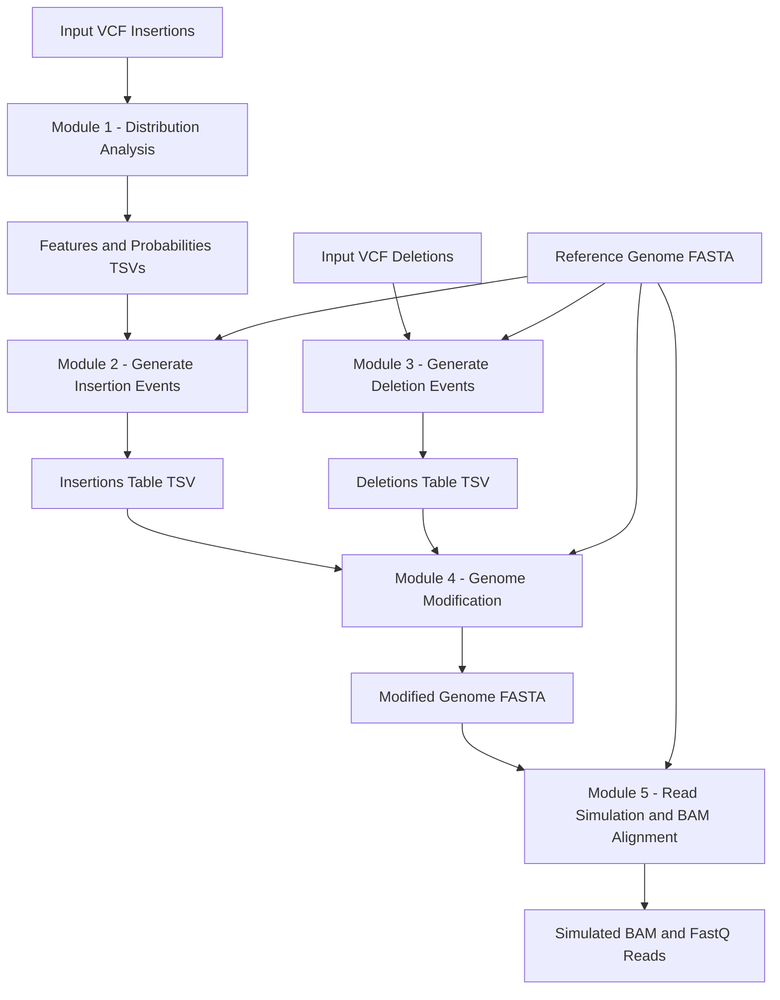

# SVModeller Documentation

**SVModeller** is a computational simulator designed to create synthetic human haplotypes containing embedded structural variants (SVs). The simulator has been trained on an extensive catalogue of curated polymorphic SVs identified across 1,019 samples from the 1000 Genomes Project sequenced with Oxford Nanopore long-read technology.

---

## Key Features

- **Realistic SV Embeddings**: Includes repetitive insertions such as Variable Number of Tandem Repeats (VNTRs), Mobile Element Insertions (MEIs: Alu, LINE-1, SVA), transductions, and mitochondrial insertions (NUMTs).
- **Structural Variant Types**: Supports Alu, LINE-1, SVA, transductions, NUMTs, VNTRs, duplications, inversions, deletions, inverted duplications, orphan insertions, and deletions.
- **Modular Design**: 5 independent modules covering distribution extraction, event generation, deletion processing, genome modification, and sub-clonal read simulation.
- **Containerized**: Run easily via Docker, Conda, or Python environment.

---

## Documentation Sections

1. [Installation Guide](installation.html): How to set up SVModeller using Docker, Conda, or Pip.
2. [Module Reference Guide](modules.html): Comprehensive parameter breakdown, input/output files, and sample commands for Modules 1 through 5.
3. [Running as a Nextflow Pipeline](installation.html#4-running-as-a-nextflow-pipeline): Guide on executing the end-to-end pipeline.
4. [Data & Reference Sets](data.html): Access pre-calculated model distributions and reference datasets on Zenodo.

---

## Workflow Overview



---

## Quick Examples

### Docker (Single Module)
```bash
# Pull the v0.5.0 Docker container
docker pull ghcr.io/biocorecrg/svmodeller:0.5.0

# Run Module 1
docker run --rm -v $(pwd):/data ghcr.io/biocorecrg/svmodeller:0.5.0 \
    Module1.py --file_path /data/VCF_Insertions.vcf --chromosome_length /data/chr_length.txt
```

### Nextflow (End-to-End Pipeline)
```bash
# Run the entire pipeline end-to-end with the test dataset
nextflow run . -profile applecontainer -params-file params.test.yaml -resume
```

---

## Developers & License

Developed by **Ismael Vera-Munoz** (orcid.org/0009-0009-2860-378X) at the Repetitive DNA Biology (REPBIO) Lab at the Centre for Genomic Regulation (CRG).

Distributed under the **AGPL-3.0 License**.

<script type="module">
  import mermaid from 'https://cdn.jsdelivr.net/npm/mermaid@10/dist/mermaid.esm.min.mjs';
  mermaid.initialize({ startOnLoad: false, theme: 'default' });

  document.addEventListener('DOMContentLoaded', async () => {
    const elements = document.querySelectorAll('.language-mermaid, pre.mermaid, div.mermaid, .highlighter-rouge.language-mermaid');
    elements.forEach((el) => {
      const codeNode = el.querySelector('code') || el;
      const code = codeNode.textContent.trim();
      const div = document.createElement('div');
      div.className = 'mermaid';
      div.textContent = code;
      el.replaceWith(div);
    });
    await mermaid.run();
  });
</script>
